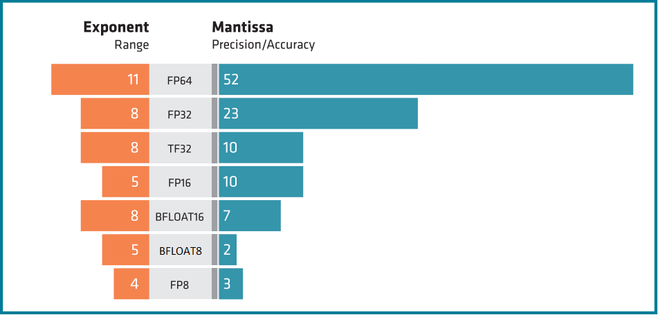

<head>
  <meta charset="UTF-8">
  <meta name="description" content="Supported data types in ROCm">
  <meta name="keywords" content="int8, float8, bfloat8, float16, half, bfloat16, tensorfloat32, float, float32, float64, double">
</head>

# Data Types

## Integer

### 8 bit integer

- range: -128 to 127

### 16 bit integer

- range: -32,768 to 32,767

### 32 bit integer

- range: -2,147,483,648 to 2,147,483,647

## Floating point

The floating-point arithmetic

### float8

- Float8E4M3FN
- range:  
- bits: 1 sign bit and 7 mantissa bit

### bfloat8
- Float8E5M2FNUZ
- range:  
- bits: 1 sign bit and 7 mantissa bit

### float16

- range: 
- bits: 1 sign bit and 7 mantissa bit

### bfloat16

- range:
- bits: 1 sign bit and 7 mantissa bit

### tensorfloat32

- range: 
- bits: 8 exponent bits, 1 sign bit and 10 mantissa bits
- Introduced by NVIDIA

### float32

- range: 
- bits: 8 exponent bits, 1 sign bit and 23 mantissa bits

### float64

- range:
- bits: 11 exponent bits, 1 sign bit and 52 mantissa bits

# The support icon description

| The support icon explanation         | Support icon  |
|:-------------------------------------|:-------------:| 
| Not supporting the specific type     | ❌           |
| Partial support of the specific type | ⚠️           |
| Supporting the specific type         | ✅           |

# Intrinsic level of precission support on AMD CDNA Cards

<!---
TODO: Add the atomic operations and check the table.
-->

| Data types   | int8  | int16  | int32 | float8 | bfloat8 | float16 | bfloat16 | tensorfloat32 | float32 | float64 |
|:-------------|:-----:|:------:|:-----:|:------:|:-------:|:-------:|:--------:|:-------------:|:-------:|:-------:|
| Mi100        | ❌    |  ❌   | ✅    | ❌    | ❌      | ✅     | ✅       | ❌           | ✅      | ✅     |
| Mi200 series | ❌    |  ❌   | ✅    | ❌    | ❌      | ✅     | ✅       | ❌           | ✅      | ✅     |
| Mi300 series | ✅    |  ❌   | ✅    | ✅    | ✅      | ✅     | ✅       | ✅           | ✅      | ✅     |

# Precission Support in ROCm Libraries

ROCm™ components precision support for int8, float8, bfloat8, int16, float16, bfloat16, int32, tensorfloat32, 
float32, int64 and float64 is listed in the following tables.

## Libraries input/output type support

The ROCm™ components support of specific input and output data type is listed in the following two tables. For detailed description open the library data type support page.

<!---
TODO: Check MIGraphX
-->

### Integer

| Library input/output integer data types                               | int8  | int16  | int32 |
|:----------------------------------------------------------------------|:-----:|:------:|:-----:|
| hipSPARSELt ({doc}`details<hipsparselt:reference/data-type-support>`) | ✅/✅ | ❌/❌| ❌/❌ | 
| rocRAND ({doc}`details<rocrand:data-type-support>`)                   | -/❌  | -/❌  | -/❌  |
| hipRAND ({doc}`details<hiprand:data-type-support>`)                   | -/❌  | -/❌  | -/❌  |
| rocPRIM ({doc}`details<rocprim:data-type-support>`)                   | ⚠️/⚠️ | ❌/❌| ✅/✅ | 
| hipCUB ({doc}`details<hipcub:data-type-support>`)                     | ⚠️/⚠️ | ❌/❌| ✅/✅ | 
| rocThrust ({doc}`details<rocthrust:data-type-support>`)               | ⚠️/⚠️ | ❌/❌| ✅/✅ | 
| MIGraphX                                                              | ✅/❌ | ❌/❌| ❌/❌ |

### Floating points

| 
Library input/output floating point data types
 | float8 | bfloat8 | float16 | bfloat16 | tensorfloat32 | float32 | float64 |
|:------------------------------------------------------------------------------|:------:|:-------:|:-------:|:--------:|:-------------:|:-------:|:-------:|
| hipSPARSELt ({doc}`details<hipsparselt:reference/data-type-support>`) | ❌/❌ | ❌/❌  | ✅/✅  | ✅/✅   | ❌/❌        | ❌/❌  | ❌/❌  |
| rocRAND ({doc}`details<rocrand:data-type-support>`)                   | -/❌  | -/❌    |  -/❌   | -/✅    | -/❌         | -/✅    | -/✅    |
| hipRAND ({doc}`details<hiprand:data-type-support>`)                   | -/❌  | -/❌    |  -/❌   | -/✅    | -/❌         | -/✅    | -/✅    |
| rocPRIM ({doc}`details<rocprim:data-type-support>`)                   | ❌/❌ | ❌/❌  | ⚠️/⚠️  | ⚠️/⚠️   | ❌/❌        | ✅/✅  | ✅/✅  |
| hipCUB ({doc}`details<hipcub:data-type-support>`)                     | ❌/❌ | ❌/❌  | ⚠️/⚠️  | ⚠️/⚠️   | ❌/❌        | ✅/✅  | ✅/✅  |
| rocThrust ({doc}`details<rocthrust:data-type-support>`)               | ❌/❌ | ❌/❌  | ⚠️/⚠️  | ⚠️/⚠️   | ❌/❌        | ✅/✅  | ✅/✅  |
| MIGraphX                                                              | ❌/❌ | ❌/❌  | ❌/❌  | ✅/✅   | ❌/❌        | ✅/✅  | ✅/✅  |

## Libraries internal calculations type support

The ROCm™ components support of specific internal data type is listed in the following two tables. For detailed description open the library data type support page.

### Integer

| Library internal integer data types                                   | int8 | int16 | int32 |
|:----------------------------------------------------------------------|:----:|:-----:|:-----:|
| hipSPARSELt ({doc}`details<hipsparselt:reference/data-type-support>`) | ❌   | ❌   | ❌   |
| MIGraphX                                                              | ✅   | ❌   | ❌   |

### Floating points

| Library internal floating point data types                            | float8 | bfloat8 | float16 | bfloat16 | tensorfloat32 | mixed precision | float32 | float64 |
|:----------------------------------------------------------------------|:------:|:-------:|:-------:|:--------:|:-------------:|:---------------:|:-------:|:-------:|
| hipSPARSELt ({doc}`details<hipsparselt:reference/data-type-support>`) | ❌    | ❌      | ✅      | ❌      | ❌            | ❌             | ✅     | ❌      |
| MIGraphX                                                              | ❌    | ❌      | ✅      | ✅      | ❌            | ❌             | ✅     | ✅      |
